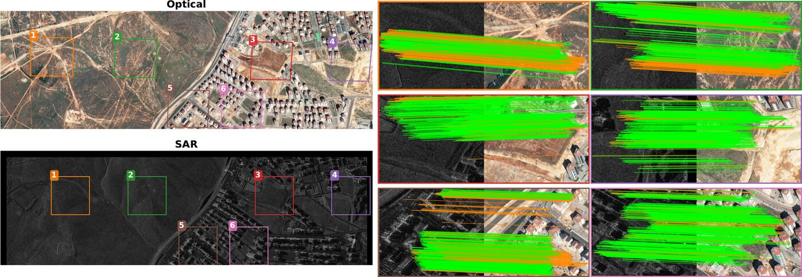

<div align="center">

# Are Pretrained Image Matchers Good Enough for SAR–Optical Satellite Registration?

**[Isaac Corley](https://isaacc.dev)** · **[Alex Stoken](https://alexstoken.github.io/)** · **[Gabriele Berton](https://gmberton.github.io/)**

CVPR 2026 Image Matching Workshop

[](https://arxiv.org/pdf/2604.10217)
[](https://isaaccorley.github.io/rsim/)
[](LICENSE)
[](https://www.python.org/)
[](https://github.com/astral-sh/uv)

</div>



We evaluate **24 pretrained image matchers** zero-shot on SAR–optical satellite registration across **SpaceNet9**, **SRIF**, and **SARptical** — no fine-tuning, no domain adaptation. The best matchers (**RoMa**, **XoFTR**) reach **3.0 px** mean tie-point error on SpaceNet9, and we show that protocol choices alone (tile size, geometry model, normalization) can shift accuracy by up to **33×** for a single matcher. Full results and analysis are on the [project page](https://isaaccorley.github.io/rsim/).

## Install

```bash
git clone https://github.com/isaaccorley/rsim.git
cd rsim
make install
```

Requires Python 3.12+ and a CUDA GPU (evaluated on a single RTX 3090). `make install` runs `uv sync --all-groups` and installs pre-commit hooks.

## Download data

**SpaceNet9:** `bash scripts/download-spacenet9.sh`

**SRIF:** Download from [LJY-RS/SRIF](https://github.com/LJY-RS/SRIF) and unpack to `data/srif/`.

**SARptical:** Download from the [TUM SiPEO group](http://www.sipeo.bgu.tum.de/downloads/SARptical_data.zip) and unpack to `data/sarptical/patch_SAR_OPT_SQUARE/`.

## Reproduce the paper

```bash
uv run python scripts/run_protocol_sweep_top_matchers.py --device cuda
uv run python scripts/run_extended_transfer_ablations.py --device cuda
uv run python scripts/run_sarptical_spacenet_methods.py
```

CSVs land in `outputs/`.

## Citation

```bibtex
@InProceedings{Corley_2026_CVPR,
    author    = {Corley, Isaac and Stoken, Alex and Berton, Gabriele},
    title     = {Are Pretrained Image Matchers Good Enough for SAR-Optical Satellite Registration?},
    booktitle = {Proceedings of the IEEE/CVF Conference on Computer Vision and Pattern Recognition (CVPR) Workshops},
    month     = {June},
    year      = {2026},
    pages     = {78-87}
}
```

## License

Released under the [Apache 2.0 License](LICENSE) by Isaac Corley.
